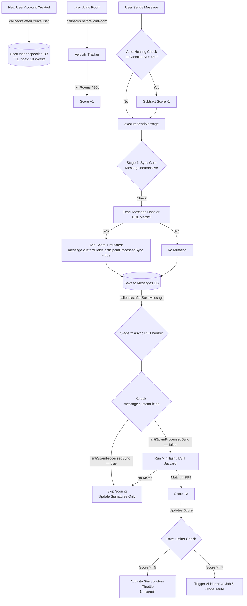

# Detailed Implementation Plan: Hybrid Behavioral Anti-Spam Engine

This document outlines the precise architectural implementation for the Rocket.Chat "New Users Anti-Spammer System". It is designed to be highly performant, catching spammers through a dual-stage message interceptor while leveraging existing Rocket.Chat utilities for rate-limiting, UI integrations, and event callbacks.

---

## 1. System Architecture & Data Flow

The system intercepts core entity actions (Targeting Messages & Room Joins) without modifying Rocket.Chat's raw base methods. It operates entirely on the `MessageService` event pipeline and event registries.



---

## 2. Core Data Modeling & Schema

To maintain a lean core, we use a shadow data approach. This model lives strictly for the 6-10 week onboarding phase using MongoDB's TTL index.

```typescript
// packages/core-typings/src/IUserUnderInspection.ts
export interface IUserUnderInspection extends IRocketChatRecord {
    _id: string;
    userId: string;
    violationScore: number;

    // --- STAGE 1: SYNC GATE (Exact Match) ---
    // Stores MD5/SHA256 hashes of recent messages for immediate O(1) matching
    exactHashes: string[]; 

    // --- STAGE 2: ASYNC LAYER (Fuzzy Match / LSH) ---
    // Stores the MinHash signatures (e.g., 128 integers each) 
    // for the last 5 messages to calculate Jaccard Similarity.
    lshSignatures: number[][]; 

    metadata: {
        // --- BEHAVIORAL TRACKING ---
        // Array of unique RIDs messaged in during the 10-week window
        processedRooms: string[]; 
        uniqueRoomsCount: number; 
        
        joinVelocity: number;      
        totalMessagesSent: number;
        aiSummary?: string;        
    };

    lastViolationAt?: Date;        
    createdAt: Date;               
}
```

---

## 3. The Scoring Matrix & Enforcement Map

This realistic scoring scale protects innocent explorers from false positives. **Level 3 (Global Admin Review) requires 7 Points.**

### A. The Triggers (Violation Accumulation)

| Trigger Component | Detection Stage | Condition | Penalty |
| :--- | :--- | :--- | :--- |
| **Abnormal Room Hopping** | `beforeJoinRoom` Callback | User joins > 4 public channels in under 60 seconds. | **+1 Point** |
| **Identical Text Matching** | Stage 1 (Sync Gate Hook) | Exact string match with any of their last 5 messages. | **+2 Points** |
| **Fuzzy / Modded Matching** | Stage 2 (Async LSH Worker) | LSH Jaccard Similarity > 85% compared to recent messages. | **+2 Points** |
| **Malicious Link Re-posting** | Stage 1 (Sync Gate Hook) | `message.urls` array contains a URL the user previously posted in a *different* room. | **+3 Points** |

**Score Decay (Event-Driven Auto-Healing):** 
Instead of relying on a heavy server cron job, the system uses an event-driven auto-healing mechanism. Every time a user attempts to send a message, the system checks their `lastViolationAt` timestamp. If more than 48 hours have passed since their last recorded infraction, the system automatically subtracts `-1` from their score *before* processing the new message. This ensures minor infractions decay naturally without manual admin intervention.

### B. The Enforcement Handlers (Chaos Scale)

| Strike Level | Score | Action Taken | Internal Mechanism Used |
| :--- | :--- | :--- | :--- |
| **Level 1** | **3+** | Automated DM Warning | Sends a direct message impersonating the system (`rocket.cat`). |
| **Level 2** | **5+** | Room Mute & Rate Limit | Triggers native `muteUserInRoom(systemId, { rid, username })` + dynamic `RateLimiter` rule limits them to 1 msg/min. |
| **Level 3** | **7+** | Global Mute & AI Radar | Strips standard roles (global mute) + Triggers AI summary generator + Pushes to Admin Dashboard. |

---

## 4. File-by-File Modification Structure

Below is the concrete map of the Rocket.Chat source files involved in this implementation.

### Phase 1: Database & Core Types
*   **Modify `packages/core-typings/src/IUser.ts`**
    *   *Action:* Add `inspectionId?: string;` to allow fast O(1) existence checks without doing a secondary collection join on every server operation.
*   **Create `packages/core-typings/src/IUserUnderInspection.ts`**
    *   *Action:* Export the interface defined above.
*   **Create `packages/models/src/models/UserUnderInspection.ts`** (Abstract)
*   **Create `apps/meteor/server/models/raw/UserUnderInspection.ts`** (Concrete MongoDB adapter)
    *   *Action:* Initialize the TTL index inside `onStartup`: `this.col.createIndex({ createdAt: 1 }, { expireAfterSeconds: 6048000 })`

### Phase 2: Message Interceptors (Sync & Async)
*   **Create `apps/meteor/server/services/anti-spam/AntiSpamService.ts`**
    *   *Action:* The main orchestrator class that runs the database updates and similarity calculations.
    *   *LSH Implementation:* Instead of building complex math from scratch, the service will utilize a standard lightweight library like `minhash` (`npm install minhash`). Text is broken into 3-character "shingles" to create the `lshSignatures`. The `jaccard()` method will compare the new signature array against the user's `UserUnderInspection.lshSignatures` history, looking for an >85% match.
*   **Create `apps/meteor/server/services/messages/hooks/BeforeSaveAntiSpam.ts`**
    *   *Action:* The Sync Gate. Checked alongside native filters (like `BadWords`). Executes O(1) hashes (MD5 or SHA-256) and URL checks. If triggered: it mutates **`message.customFields.antiSpamProcessedSync = true`** so the Async worker does not double-count the penalty.
*   **Modify / Attach to `apps/meteor/server/lib/callbacks.ts` Registries:**
    *   Register **`afterCreateUser`**: Initialize the DB record.
    *   Register **`beforeJoinRoom`**: Update `uniqueRoomsCount` and run velocity math.
    *   Register **`afterSaveMessage`**: The Async Worker layer. It explicitly skips similarity math if `message.customFields.antiSpamProcessedSync === true`.

### Phase 3: Dynamic Rate Limiting
*   **Modify `apps/meteor/app/lib/server/lib/RateLimiter.ts`** (Or initialize in `AntiSpamService.ts`)
    *   *Action:* Add a custom `RateLimiter.limitMethod('sendMessage', 1, 60000)` rule that intercepts outgoing messages. The rule's `userId()` callback returns `true` *only* if the underlying `UserUnderInspection.violationScore >= 5`, automatically throttling them.

### Phase 4: Summaries & On-Demand AI Diagnostic Analysis
*   **Rule-Based Behavior Summary (Immediate/Channel Level):** 
    *   *Action:* Instead of relying on a costly AI for every single flag, the system will instantly generate a pre-formatted, deterministic summary (e.g., *"User hit 7 points; generated 2 Exact Link Matches in 4 rooms within 5 minutes"*). This guarantees 100% reliability for standard moderators.
*   **Create `apps/meteor/server/services/anti-spam/AiDiagnosticReport.ts` (On-Demand AI):**
    *   *Action:* An endpoint strictly triggered **manually by Global Admins** when they want to deeply investigate a highly suspicious user.
    *   *Prompt Construction:* Gathers the raw `UserUnderInspection` statistics + the user's **last 15 public channel messages**. It formats this payload and passes it to Rocket.Chat's configured LLM App.
    *   *Output:* A detailed, contextual narrative combining both metrics and message intent to yield highly specific **Suggested Moderation Actions** before an Admin decides to globally ban or vouch.

### Phase 5: Moderation UI (Admin Visibility & Reversibility)
*   *Requirement Focus:* **Actions must be reversible and configurable.** Admins must have full visibility into flags and logs.
*   **Modify `apps/meteor/client/views/room/contextualBar/UserInfo/UserInfoWithData.tsx`**
    *   *Action (Channel Level):* When a room Moderator clicks a user, dynamically display an orange/red **Spam risk flag** and the basic rule-based behavior log.
*   **Modify `apps/meteor/client/views/room/contextualBar/UserInfo/UserInfoActions.tsx`**
    *   *Action (Reversibility):* Add a "Vouch for User" button that safely zeroes-out the violation score and lifts any rate-limits for falsely flagged members.
*   **Modify `apps/meteor/client/views/admin/moderation/ModerationConsolePage.tsx`** 
    *   *Action (Workspace Level - Admin Visibility):* Add a new "Anti-Spam Watchlist" tab explicitly targeting accounts with Scores `> 0`. This dashboard will display:
        *   **Suspicious activity logs** (What rules they broke and when).
        *   A **"Request On-Demand AI Analysis"** button that fetches the deep LLM behavioral summary.
        *   Buttons to instantly *Ban*, *Mute*, or *Vouch* (Reverse all penalties).

### Phase 6: Basic Reporting (Cron & Endpoints)
*   **Create `apps/meteor/server/services/anti-spam/ReportingService.ts`**
    *   *Action:* A lightweight daily job that aggregates data from the `UserUnderInspection` collection to generate a basic report for workspace administrators.
    *   *Outputs:*
        *   **Newly flagged users:** How many users entered the shadow DB today.
        *   **Daily risk changes:** Shifts in user violation scores.
        *   **Triggered moderation actions:** Count of autobans/mutes executed by Level 2 and Level 3 rules.
        *   **Detected spam patterns:** Most common triggers (e.g., LSH Fuzzy Match vs Exact Hash URLs).

---

## 7. About Me

*   **Name:** [Your Name]
*   **University/Major:** [Your University name], [Your Major], Year [Your Year]
*   **Timezone:** [Your Timezone]
*   **Time Commitment:** I can dedicate [30-40] hours per week to this project during the GSoC 2026 period.
*   **Technical Skills:** Node.js, TypeScript, MongoDB, React, Meteor, API Design.

## 8. About Me on Open Source

*   **Contributions to Rocket.Chat:** 
    *   [PR Link 1] - [Short description of what you fixed/built]
    *   [PR Link 2] - [Short description of what you fixed/built]
    *   *(Note: Remember to actually make at least 1-2 small PRs before submitting if you haven't!)*
*   **Other Projects:** [Mention any relevant personal projects or other open source contributions related to web performance, security, or full-stack development]

## 9. Proposed Timeline (GSoC 2026 Schedule)

*   **Community Bonding (Weeks 1-3):** Finalize architectural decisions with mentors, configure the local development environment for the `minhash` package, and finalize the `UserUnderInspection` database schema.
*   **Phase 1 (Weeks 4-5):** Implement the `UserUnderInspection` model with MongoDB TTL indexes. Hook into the `afterCreateUser` registry.
*   **Phase 2 (Weeks 6-7):** Build the Sync Gate (`BeforeSaveAntiSpam`) focusing on exact-match hashing (O(1)) and `message.urls` cross-posting rules. Establish the scoring matrix foundation.
*   **Midterm Evaluation (Week 8):** Deliver a working synchronous layer where users breaching Level 1 rules are dynamically warned and rate-limited.
*   **Phase 3 (Weeks 9-10):** Develop the Async LSH Worker for processing fuzzy matches (Jaccard similarity via `minhash`). Implement the Event-Driven Auto-Healing (score decay) mechanism.
*   **Phase 4 (Weeks 11-12):** Build the Moderation Console (Admin UI), the basic reporting cron jobs, and integrate the **On-Demand AI Prompting** logic. Write unit tests (Jest) for the scoring engine and E2E tests (Playwright) for the UI.
*   **Final Week:** Final code cleanup, documentation writing, and merging final PRs.

## 10. Testing, Edge Cases & Configuration

*   **Testing Strategy:** 
    *   **Jest:** For unit testing the scoring engine, ensuring accurate math and decay logic without race conditions.
    *   **Playwright:** E2E testing for the newly added Admin Moderation UI to ensure data binds correctly.
*   **Reversible & Configurable Constraints (Workspace Settings):** 
    *   A new setting will be added to `Administration > Workspace > Settings` enabling server admins to globally **Enable/Disable** the Anti-Spam Pipeline.
    *   Admins will be given parameters to adjust the strike thresholds (e.g., adjusting Level 1 points from 3 to 4) to accommodate their unique community needs.
*   **Create `apps/meteor/server/api/v1/anti-spam.ts`**
    *   *Action:* Provide `GET /v1/anti-spam.getScore` (REST Endpoint) for the React clients to fetch user shadow data securely (gated by `view-privileged-setting` permissions) as well as endpoints to generate the basic reports.