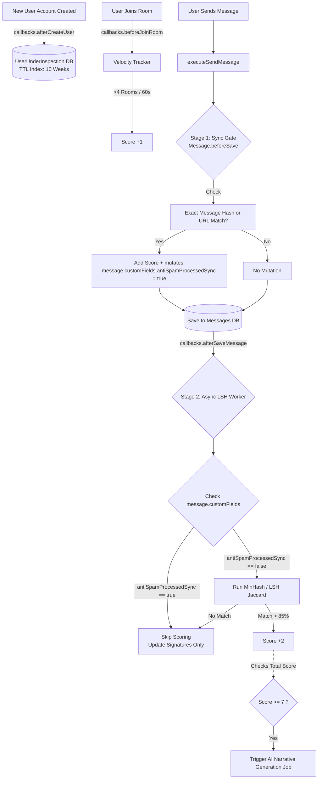

# Detailed Implementation Plan: Hybrid Behavioral Anti-Spam Engine

This document outlines the precise architectural implementation for the Rocket.Chat "New Users Anti-Spammer System". It is designed to be highly performant, catching spammers through a dual-stage message interceptor while leveraging existing Rocket.Chat utilities for rate-limiting, UI integrations, and event callbacks.

---

## 1. System Architecture & Data Flow

The system intercepts core entity actions (Targeting Messages & Room Joins) without modifying Rocket.Chat's raw base methods. It operates entirely on the `MessageService` event pipeline and event registries.



---

## 2. Core Data Modeling & Schema

To maintain a lean core, we use a shadow data approach. This model lives strictly for the 6-10 week onboarding phase using MongoDB's TTL index.

```typescript
// packages/core-typings/src/IUserUnderInspection.ts
export interface IUserUnderInspection extends IRocketChatRecord {
    _id: string;
    userId: string;
    violationScore: number;

    // --- STAGE 1: SYNC GATE (Exact Match) ---
    // Stores MD5/SHA256 hashes of recent messages for immediate O(1) matching
    exactHashes: string[]; 

    // --- STAGE 2: ASYNC LAYER (Fuzzy Match / LSH) ---
    // Stores the MinHash signatures (e.g., 128 integers each) 
    // for the last 5 messages to calculate Jaccard Similarity.
    lshSignatures: number[][]; 

    metadata: {
        // --- BEHAVIORAL TRACKING ---
        // Array of unique RIDs messaged in during the 10-week window
        processedRooms: string[]; 
        uniqueRoomsCount: number; 
        
        joinVelocity: number;      
        totalMessagesSent: number;
        aiSummary?: string;        
    };

    lastViolationAt?: Date;        
    createdAt: Date;               
}
```

---

## 3. The Scoring Matrix & Enforcement Map

This realistic scoring scale protects innocent explorers from false positives. **Level 3 (Global Admin Review) requires 7 Points.**

### A. The Triggers (Violation Accumulation)

| Trigger Component | Detection Stage | Condition | Penalty |
| :--- | :--- | :--- | :--- |
| **Abnormal Room Hopping** | `beforeJoinRoom` Callback | User joins > 4 public channels in under 60 seconds. | **+1 Point** |
| **Identical Text Matching** | Stage 1 (Sync Gate Hook) | Exact string match with any of their last 5 messages. | **+2 Points** |
| **Fuzzy / Modded Matching** | Stage 2 (Async LSH Worker) | LSH Jaccard Similarity > 85% compared to recent messages. | **+2 Points** |
| **Malicious Link Re-posting** | Stage 1 (Sync Gate Hook) | `message.urls` array contains a URL the user previously posted in a *different* room. | **+3 Points** |

**Score Decay (Automated Forgiveness):** 
A scheduled cron job checks the `lastViolationAt` timestamp. If 48 hours have passed with zero infractions, it subtracts `-1` from the score.

### B. The Enforcement Handlers (Chaos Scale)

| Strike Level | Score | Action Taken | Internal Mechanism Used |
| :--- | :--- | :--- | :--- |
| **Level 1** | **3+** | Automated DM Warning | Sends a direct message impersonating the system (`rocket.cat`). |
| **Level 2** | **5+** | Room Mute & Rate Limit | Triggers native `muteUserInRoom(systemId, { rid, username })` + dynamic `RateLimiter` rule limits them to 1 msg/min. |
| **Level 3** | **7+** | Global Mute & AI Radar | Strips standard roles (global mute) + Triggers AI summary generator + Pushes to Admin Dashboard. |

---

## 4. File-by-File Modification Structure

Below is the concrete map of the Rocket.Chat source files involved in this implementation.

### Phase 1: Database & Core Types
*   **Modify `packages/core-typings/src/IUser.ts`**
    *   *Action:* Add `inspectionId?: string;` to allow fast O(1) existence checks without doing a secondary collection join on every server operation.
*   **Create `packages/core-typings/src/IUserUnderInspection.ts`**
    *   *Action:* Export the interface defined above.
*   **Create `packages/models/src/models/UserUnderInspection.ts`** (Abstract)
*   **Create `apps/meteor/server/models/raw/UserUnderInspection.ts`** (Concrete MongoDB adapter)
    *   *Action:* Initialize the TTL index inside `onStartup`: `this.col.createIndex({ createdAt: 1 }, { expireAfterSeconds: 6048000 })`

### Phase 2: Message Interceptors (Sync & Async)
*   **Create `apps/meteor/server/services/anti-spam/AntiSpamService.ts`**
    *   *Action:* The main orchestrator class that calculates LSH and manages database updates.
*   **Create `apps/meteor/server/services/messages/hooks/BeforeSaveAntiSpam.ts`**
    *   *Action:* The Sync Gate. Checked alongside native filters (like `BadWords`). Executes O(1) hashes and URL checks. If triggered: it mutates **`message.customFields.antiSpamProcessedSync = true`** so the Async worker does not double-count the penalty.
*   **Modify / Attach to `apps/meteor/server/lib/callbacks.ts` Registries:**
    *   Register **`afterCreateUser`**: Initialize the DB record.
    *   Register **`beforeJoinRoom`**: Update `uniqueRoomsCount` and run velocity math.
    *   Register **`afterSaveMessage`**: The Async Worker layer. It explicitly skips similarity math if `message.customFields.antiSpamProcessedSync === true`.

### Phase 3: Dynamic Rate Limiting
*   **Modify `apps/meteor/app/lib/server/lib/RateLimiter.ts`** (Or initialize in `AntiSpamService.ts`)
    *   *Action:* Add a custom `RateLimiter.limitMethod('sendMessage', 1, 60000)` rule that intercepts outgoing messages. The rule's `userId()` callback returns `true` *only* if the underlying `UserUnderInspection.violationScore >= 5`, automatically throttling them.

### Phase 4: Targeted AI Generation
*   **Create `apps/meteor/server/services/anti-spam/AiDiagnosticReport.ts`**
    *   *Action:* Triggered strictly when a user breaches **7 Points**. Fetches the user's last 15-20 messages and raw velocity metrics. Formats a lean prompt for the Workspace's configured AI provider (e.g., OpenAI API) asking for a 2-sentence spam narrative. Saves output directly to `.metadata.aiSummary`.

### Phase 5: Moderation UI (Front-End)
*   **Modify `apps/meteor/client/views/room/contextualBar/UserInfo/UserInfoWithData.tsx`**
    *   *Action (Channel Level):* When a room Moderator clicks a user, dynamically display an orange/red "Spam Risk" badge based on their score API fetch.
*   **Modify `apps/meteor/client/views/room/contextualBar/UserInfo/UserInfoActions.tsx`**
    *   *Action (Channel Level):* Add a "Vouch for User" button that safely zeroes-out the violation score for falsely flagged members.
*   **Modify `apps/meteor/client/views/admin/moderation/ModerationConsolePage.tsx`** 
    *   *Action (Workspace Level):* Add a "New Users Watchlist" tab explicitly targeting accounts with Scores `> 0`. Displays a high-level table integrating the triggered `aiSummary` to provide instant context for the Global Admin's final decision (Deactivate completely or Vouch).
*   **Create `apps/meteor/server/api/v1/anti-spam.ts`**
    *   *Action:* Provide `GET /v1/anti-spam.getScore` (REST Endpoint) for the React clients to fetch user shadow data securely (gated by `view-privileged-setting` permissions).